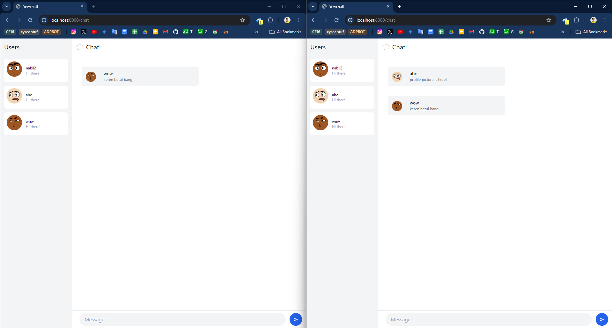

# Tutorial 10.3 Reflection Notes

## 3.1 Original Code

Screenshot:

## 3.2 Be Creative!

Screenshot:

Pada eksperimen ini, tidak banyak hal yang saya ubah. Saya hanya menambahkan foto profil random untuk setiap user yang masuk ke dalam chat. Hal ini melanjutkan sekaligus memperbaiki outdated API yang digunakan pada kode aslinya. Setelah membaca dokumentasi terbarunya, maka URL API-nya saya perbaiki. Menggunakan username setiap user sebagai seed randomisasi, maka setiap pengguna sekarang akan memiliki foto profil random apabila sudah masuk ke halaman chat.
